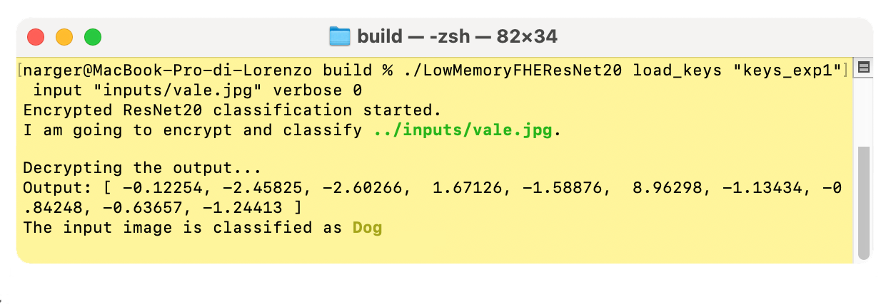
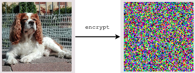
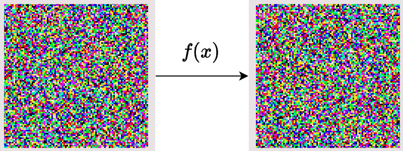
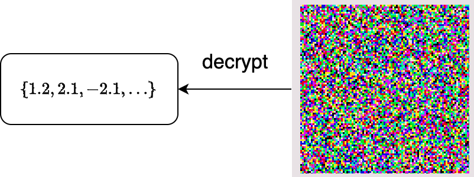
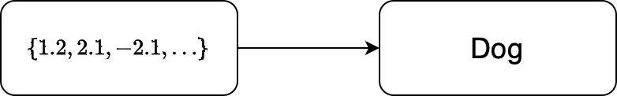

# Encrypted Image Classification with Low Memory Footprint using Fully Homomorphic Encryption
<center>

</center>


---

This repository contains a OpenFHE-based project that implements an encrypted version of the ResNet20 model, used to classify encrypted CIFAR-10 images.

The reference paper for this work is [Encrypted Image Classification with Low Memory Footprint using Fully Homomorphic Encryption](https://doi.org/10.1142/S0129065724500254). A preprint is available on [ePrint Archive](https://eprint.iacr.org/2024/460)

The key idea behind this work is to propose a solution to run a CNN in relative small time ($<5$ minutes on my MacBook M1 Pro with 16GB RAM) and, moreover, to use a small amount of memory. 

De Castro et al. [6] showed that memory is currently the main bottleneck to be addressed in FHE circuits, although most of the works do not consider it as a metric when building FHE solutions.

Existing works use a lot of memory ([4]: $\approx$ 100GB, [5]: $\approx$ 500GB), while this implementation uses less than 16GB, making it usable by normal users.

## Technical details

The circuit is based on the RNS-CKKS implementation [1] in OpenFHE [2].
We propose an approach to convolutions called _Optimized Vector Encoding_, which enabled to evaluate a convolution using only five Automorphism Keys, needed to rotate the values of the ciphertext. These are the heaviest objects in memory, therefore by minimizing the use of these keys, it is possible to reduce the memory footprint of the application.

Experiments show that it is possible to evaluate the circuit in less than 5 minutes (in [3] it requires more than 6 minutes) and by using a small amount of RAM, from 10GB to 15GB, depending on the desired precision and speed.


## Architecture

The program simulates a server-client interaction in which the server is assumed to be honest-but-curious. 

Both client and server agree on a pair public-secrey key that is based on Ring Learning With Errors (RLWE) [3]: a post-quantum hard problem defined as follows:

Given a polynomial ring $\mathcal{R} = Z[X]/(X^N + 1)$ and small Gaussian distribution $\chi$:

* Secret key: $s \gets \chi$ is a polynomial with random coefficients in $\mathcal{R}$
* Public key: $(a, b)$, where $a$ is a random polynomial in $\mathcal{R}$, and $b = a \cdot s + e$, with $e \gets \chi$

The idea is to use $b$, which, without the secret key $s$ would look like a random element, to encrypt the image.

1) The client encrypts the image using the public key.




2) The server performs computations on it (following the definition of Fully Homomorphic Encryption)




3) The server returns an encrypted vector containing the output of the last fully connected layer. The client is able to decrypt it and see the result



4) The client finds the index of the maximum value and, using a dictionary, find the classified label




## How to run

> [!IMPORTANT]
> With newer versions of OpenFHE, a `DropLastElement: Removing last element of DCRTPoly renders it invalid.` error may pop up. This happens because of an additional multiplication performed by the bootstrapping. I suggest you two solutions:
> - Relax the security parameters to (NotSet) and increase the circuit depth by 1. This will not give you a 128-bits secure circuit anymore, something less.
> - Increase the ring dimension to $2^{17}$ and increase the circuit depth by 1. This will still give you $>128$-bits of security, but time and memory will be doubled.

### Prerequisites
Linux or Mac operative system, with at least 16GB of RAM.

In order to run the program, you need to install:
- `cmake`
- `g++` or `clang`
- `OpenFHE` ([how to install OpenFHE](https://openfhe-development.readthedocs.io/en/latest/sphinx_rsts/intro/installation/installation.html)), this work has been tested on v1.0.4

### 1) Build the project

Setup the project using this command:
```
mkdir build
cmake -B "build" -S LowMemoryFHEResNet20
```
Then build it using
```
cmake --build "build" --target
```

### 2) Execute the project

After building, go to the created `build` folder:

```
cd build
```
and run it with the following command:
```
./LowMemoryFHEResNet20
```

### 3) Custom arguments

- `generate_keys`, type `int`, a value in `[1, 2, 3, 4]`
- `load_keys`, type: `int` a value in `[1, 2, 3, 4]`
- `input`, type: `string`, the filename of a custom image. **MUST** be a three channel RGB 32x32 image either in `.jpg` or in `.png` format
- `verbose` a value in `[-1, 0, 1, 2]`, the first shows no information, the last shows a lot of messages
- `plain`: added when the user wants the plain result too. Note: enabling this option means that a Python script will be executed after the encrypted inference. This script requires the following modules: `torch`, `torchvision`, `PIL`, `numpy`.

#### Some examples 

The first execution should be launched with the `generate_keys` argument, using the preferred set of parameters. Check the paper to see the differences between them. For instance, we choose the set of parameters defined in the first experiment:
```
./LowMemoryFHEResNet20 generate_keys 1
```
This command create the required keys and stores them in a new folder called `keys_exp1`, in the root folder of the project.

The default command creates a new context and classifies the default image in `inputs/luis.png`. We can, however, use custom arguments.
We can use a set of serialized context and keys with the argument `load_keys` as follows:

```
./LowMemoryFHEResNet20 load_keys 1
```
This command loads context and keys from the folder `keys_exp1`, located in the root folder of the project, and runs an inference on the default image.
Then, in order to load a custom image, we use the argument `input` as follows:

```
./LowMemoryFHEResNet20 load_keys 1 input "inputs/vale.jpg"
```
Even for this argument, the starting position will be the root of the project.
We can also compare the result with the plain version of the model, using the `plain` keyword:

```
./LowMemoryFHEResNet20 load_keys 1 input "inputs/vale.jpg" plain
```

This command will launch a Python script at the end of the encrypted comptations, giving the plain output (which will differ from the encrypted one according to the parameters, check the paper for the precision values of each set of parameters).
Notice that `plain` requires a few things in order to be used:

- `python3`
- `torch`
- `torchvision`
- `PIL`
- `numpy`

## Interpreting the output
The output of the encrypted model is a vector consisting of 10 elements. In order to interpret it, it is enough to find the index of the maximum element. A sample output could be:

```
output = [-2.633, -1.091,  6.063, -4.093, -0.5967, 7.252, -2.156, -1.085, -0.9119, -0.7291]
```
In this case, the maximum value is at position 5. Just translate it using the following dictionary (from ResNet20 pretrained on CIFAR-10):

| Index of max 	| Class      	|
|--------------	|------------	|
| 0            	| Airplane   	|
| 1            	| Automobile 	|
| 2            	| Bird       	|
| 3            	| Cat        	|
| 4            	| Deer       	|
| 5            	| Dog        	|
| 6            	| Frog       	|
| 7            	| Horse      	|
| 8            	| Ship       	|
| 9            	| Truck      	|

In the sample output, the input image was my dog Vale:

> 

---

Another output could be

```
output = [-0.719, -4.19, -0.252, 12.04, -4.979, 4.413, -0.5173, -1.038, -2.229, -2.504]
```

In this case, the index of max is 3, which is nice, since the input image was Luis the cat:

> 

So it was correct!

## Comparing to the plain model

In the `notebook` folder, it is possible to find different useful notebooks that can be used in order to compute the precision of a computation, with respect to the plain model, in details for each layer. 

## Citing
In case you want to cite our work, feel free to do it using the following BibTeX entry:

```
@article{rovidaleporati,
   author = {Rovida, Lorenzo and Leporati, Alberto},
   title = {Encrypted Image Classification with Low Memory Footprint Using Fully Homomorphic Encryption},
   journal = {International Journal of Neural Systems},
   volume = {34},
   number = {05},
   pages = {2450025},
   year = {2024},
   doi = {10.1142/S0129065724500254}
}
```

## Authors

- Lorenzo Rovida (`lorenzo.rovida@unimib.it`)
- Alberto Leporati (`alberto.leporati@unimib.it`)

Made with <3  at [Bicocca Security Lab](https://www.bislab.unimib.it), at University of Milan-Bicocca.


### Declaration

This is a proof of concept and, even though parameters are created with $\lambda \geq 128$ security bits (according to [Homomorphic Encryption Standards](https://homomorphicencryption.org/standard)), this circuit is intended for educational purposes only.


## Bibliography

[1] Kim, A., Papadimitriou, A., & Polyakov, Y. (2022). 
Approximate Homomorphic Encryption with Reduced Approximation Error. In: Galbraith, S.D. (eds) Topics in Cryptology – CT-RSA 2022. CT-RSA 2022. Lecture Notes in Computer Science, vol 13161. Springer, Cham.

[2] Al Badawi, A., Bates, J., Bergamaschi, F., Cousins, D. B., Erabelli, S., Genise, N., Halevi, S., Hunt, H., Kim, A., Lee, Y., Liu, Z., Micciancio, D., Quah, I., Polyakov, Y., R.V., S., Rohloff, K., Saylor, J., Suponitsky, D., Triplett, M., Zucca, V. (2022). *OpenFHE: Open-Source Fully Homomorphic Encryption Library*. Proceedings of the 10th Workshop on Encrypted Computing & Applied Homomorphic Cryptography, 53–63.

[3] Lyubashevsky, V., Peikert, C., & Regev, O. (2010). *On Ideal Lattices and Learning with Errors over Rings*. In: Gilbert, H. (eds) Advances in Cryptology – EUROCRYPT 2010. EUROCRYPT 2010. Lecture Notes in Computer Science, vol 6110. Springer, Berlin, Heidelberg.

[4] Kim, D., & Guyot, C. (2023). *Optimized Privacy-Preserving CNN Inference With Fully Homomorphic Encryption*. In IEEE Transactions on Information Forensics and Security, vol. 18, pp. 2175-2187.

[5] Lee, E., Lee, J. W., Lee, J., Kim, Y. S., Kim, Y., No, J. S., & Choi, W. (2022, June). *Low-complexity deep convolutional neural networks on fully homomorphic encryption using multiplexed parallel convolutions*. In International Conference on Machine Learning (pp. 12403-12422). PMLR.

[6] De Castro, L., Agrawal, R., Yazicigil, R., Chandrakasan, A., Vaikuntanathan, V., Juvekar, C., & Joshi, A. (2021). Does Fully Homomorphic Encryption Need Compute Acceleration?
