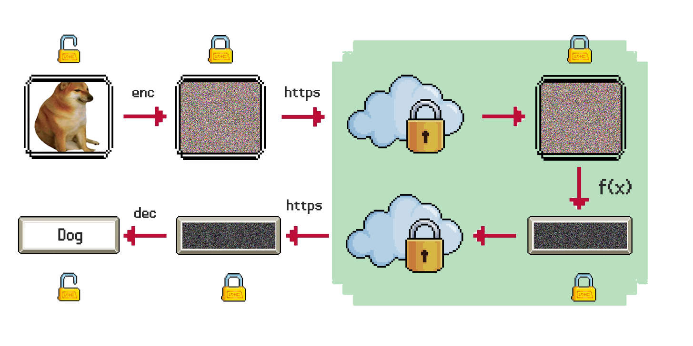

# Low Memory FHE-based ResNet20
This repository contains a OpenFHE-based project that implements an encrypted version of the ResNet20 model, used to classify encrypted CIFAR10 images. 

The key idea behind this work is to propose a solution to run a CNN in relative small time (<5 mins on my Macbook M1 Pro) and, moreover, to use a small amount of RAM. Existing works use a lot of memory ([1]: $\approx$ 100GB, [2]: $\approx$ 500GB), while this implementation uses at most 16GB.

## Architecture



Bla bla

## How to run
In order to run the program OpenFHE needs to be installed in the system. Check [how to install OpenFHE](https://openfhe-development.readthedocs.io/en/latest/sphinx_rsts/intro/installation/installation.html).

### 1) Build the project

Build the project using this command:
```
mkdir build
cmake --build "build" --target LowMemoryFHEResNet20
```
You can also use the `-j` flag in order to speed up the compilation, just put the number of cores of your machine. For instance:
```
cmake --build "build" --target LowMemoryFHEResNet20 -j 8
```

### 2) Execute the project

After building, go to the created `build` folder:

```
cd build
```
and run it with the following command:
```
./LowMemoryFHEResNet20
```

### 3) Custom arguments

The default command creates a new context and classifies the default image in `inputs/louis.jpg`. We can, however, use custom arguments.
We can use a set of serialized context and keys with the argument `context` as follows:

```
./LowMemoryFHEResNet20 context "parameters_first_experiment"
```
This command loads context and keys from the folder `parameters_first_experiment`, located in the root folder of the project.
Lastly, in order to load a custom image, we use the argument `input` as follows:

```
./LowMemoryFHEResNet20 context "parameters_first_experiment" input "inputs/louis.jpg"
```
Even for this argument, the starting position will be the root of the project.

### Bibliography 
[1] D. Kim and C. Guyot, "Optimized Privacy-Preserving CNN Inference With Fully Homomorphic Encryption," in IEEE Transactions on Information Forensics and Security, vol. 18, pp. 2175-2187, 2023, doi: 10.1109/TIFS.2023.3263631.

[2] Lee, E., Lee, J. W., Lee, J., Kim, Y. S., Kim, Y., No, J. S., & Choi, W. (2022, June). Low-complexity deep convolutional neural networks on fully homomorphic encryption using multiplexed parallel convolutions. In International Conference on Machine Learning (pp. 12403-12422). PMLR.
