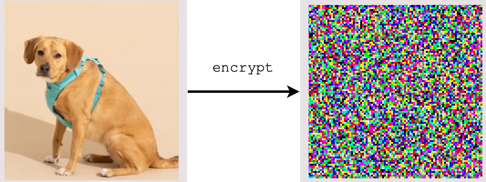

# ResNet20 based on FHE with Low Memory Overhead


---

This repository contains a OpenFHE-based project that implements an encrypted version of the ResNet20 model, used to classify encrypted CIFAR10 images.

The reference paper for this work is [Low memory overhead secure ResNet inference based on Fully Homomorphic Encryption](google.it), (2023, Lorenzo Rovida and Alberto Leporati).

The key idea behind this work is to propose a solution to run a CNN in relative small time ($<5$ minutes on my MacBook M1 Pro with 16GB RAM) and, moreover, to use a small amount of memory.

Existing works use a lot of memory ([]: $\approx$ 100GB, []: $\approx$ 500GB), while this implementation uses at most 16GB, making it usable by normal users.

## Technical details

The circuit is based on the RNS-CKKS implementation [1] in OpenFHE [2].
We propose an approach to convolutions called _Optimized Vector Encoding_, which enabled to evaluate a convolution using only five Automorphism Keys, needed to rotate the values of the ciphertext. These are the heaviest objects in memory, therefore by minimizing the use of these keys, it is possible to reduce the memory footprint of the application.

Experiments show that it is possible to evaluate the circuit in less than 5 minutes (in [3] it requires more than 6 minutes) and by using a small amount of RAM, from 10GB to 15GB, depending on the desired precision and speed.


## Architecture

The program simulates a server-client interaction in which the server is assumed to be honest-but-curious. 

Both client and server agree on a pair public-secrey key that is based on Ring Learning With Errors (RLWE) [3]: a post-quantum hard problem defined as follows:

Given a polynomial ring $\mathcal{R} = Z[X]/(X^N + 1)$ and small Gaussian distribution $\chi$:

* Secret key: $s \gets \chi$ is a polynomial with random coefficients in $\mathcal{R}$
* Public key: $(a, b)$, where $a$ is a random polynomial in $\mathcal{R}$, and $b = a \cdot s + e$, with $e \gets \chi$

The idea is to use $b$, which, without the secret key $s$ would look like a random element, to encrypt the image.


1) The client encrypts the image using the public key.



3) The server performs computations on it (following the definition of Fully Homomorphic Encryption)

4) The server returns an encrypted vector containing the output of the last fully connected layer.

5) Only the client, though, can "open" the ciphertext and see the result of the classifiction


## How to run
In order to run the program OpenFHE needs to be installed in the system. Check [how to install OpenFHE](https://openfhe-development.readthedocs.io/en/latest/sphinx_rsts/intro/installation/installation.html).

### 1) Build the project

Build the project using this command:
```
mkdir build
cmake --build "build" --target LowMemoryFHEResNet20
```
You can also use the `-j` flag in order to speed up the compilation, just put the number of cores of your machine. For instance:
```
cmake --build "build" --target LowMemoryFHEResNet20 -j 8
```

### 2) Execute the project

After building, go to the created `build` folder:

```
cd build
```
and run it with the following command:
```
./LowMemoryFHEResNet20
```

### 3) Custom arguments

- `generate_keys`, a value in `[params_exp1, params_exp2, params_exp3, params_exp4]`
- `load_keys`, type: `string`
- `input`, type: `string`
- `verbose` a value in `[-1, 0, 1, 2]`, the first shows no information, the last shows a lot of messages


The first execution should be launched with the `generate_keys` argument, using the preferred set of parameters. Check the paper to see the differences between them. For instance, we choose the set of parameters defined in the first experiment:
```
./LowMemoryFHEResNet20 generate_keys "params_exp1"
```
This command create the required keys and stores them in a new folder called `params_exp1`, in the root folder of the project.

The default command creates a new context and classifies the default image in `inputs/louis.jpg`. We can, however, use custom arguments.
We can use a set of serialized context and keys with the argument `context` as follows:

```
./LowMemoryFHEResNet20 context "parameters_first_experiment"
```
This command loads context and keys from the folder `parameters_first_experiment`, located in the root folder of the project.
Lastly, in order to load a custom image, we use the argument `input` as follows:

```
./LowMemoryFHEResNet20 context "parameters_first_experiment" input "inputs/louis.jpg"
```
Even for this argument, the starting position will be the root of the project.

## Interpreting the output
The output of the encrypted model is a vector consisting of 10 elements. In order to interpret it, it is enough to find the index of the maximum element. A sample output could be:

```
output = [-2.6369, -1.0997,  6.0637, -4.0931, -0.5967, 7.2524, -2.1562, -1.0855, -0.9119, -0.7291]
```
In this case, the maximum value is at position 5. Just translate it using the following dictionary (from ResNet20 pretrained on CIFAR-10):

| Index of max 	| Class      	|
|--------------	|------------	|
| 0            	| Airplane   	|
| 1            	| Automobile 	|
| 2            	| Bird       	|
| 3            	| Cat        	|
| 4            	| Deer       	|
| 5            	| Dog        	|
| 6            	| Frog       	|
| 7            	| Horse      	|
| 8            	| Ship       	|
| 9            	| Truck      	|

In the sample output, the input image was the my dog Vale:


So it was correct!

## Declaration

This is a proof of concept and, even though parameters are created wtih $\lambda = 128$ security bits, this circuit should not be used in production.

## Authors
(To be removed before submitting the paper)

- Lorenzo Rovida (`lorenzo.rovida@unimib.it`)
- Alberto Leporati (`alberto.leporati@unimib.it`)

Made with <3  at [Bicocca Security Lab](https://www.bislab.unimib.it), at University of Milan-Bicocca.


---

## Bibliography

[1] Kim, A., Papadimitriou, A., Polyakov, Y. (2022). Approximate Homomorphic Encryption with Reduced Approximation Error. In: Galbraith, S.D. (eds) Topics in Cryptology – CT-RSA 2022. CT-RSA 2022. Lecture Notes in Computer Science(), vol 13161. Springer, Cham. https://doi.org/10.1007/978-3-030-95312-6_6

[2] Al Badawi, A., Bates, J., Bergamaschi, F., Cousins, D. B., Erabelli, S., Genise, N., Halevi, S., Hunt, H., Kim, A., Lee, Y., Liu, Z., Micciancio, D., Quah, I., Polyakov, Y., R.V., S., Rohloff, K., Saylor, J., Suponitsky, D., Triplett, M., … Zucca, V. (2022). OpenFHE: Open-Source Fully Homomorphic Encryption Library. Proceedings of the 10th Workshop on Encrypted Computing & Applied Homomorphic Cryptography, 53–63. https://doi.org/10.1145/3560827.3563379

[3] Lyubashevsky, V., Peikert, C., Regev, O. (2010). On Ideal Lattices and Learning with Errors over Rings. In: Gilbert, H. (eds) Advances in Cryptology – EUROCRYPT 2010. EUROCRYPT 2010. Lecture Notes in Computer Science, vol 6110. Springer, Berlin, Heidelberg. https://doi.org/10.1007/978-3-642-13190-5_1

[4] D. Kim and C. Guyot, "Optimized Privacy-Preserving CNN Inference With Fully Homomorphic Encryption," in IEEE Transactions on Information Forensics and Security, vol. 18, pp. 2175-2187, 2023, doi: 10.1109/TIFS.2023.3263631.

[5] Lee, E., Lee, J. W., Lee, J., Kim, Y. S., Kim, Y., No, J. S., & Choi, W. (2022, June). Low-complexity deep convolutional neural networks on fully homomorphic encryption using multiplexed parallel convolutions. In International Conference on Machine Learning (pp. 12403-12422). PMLR.
